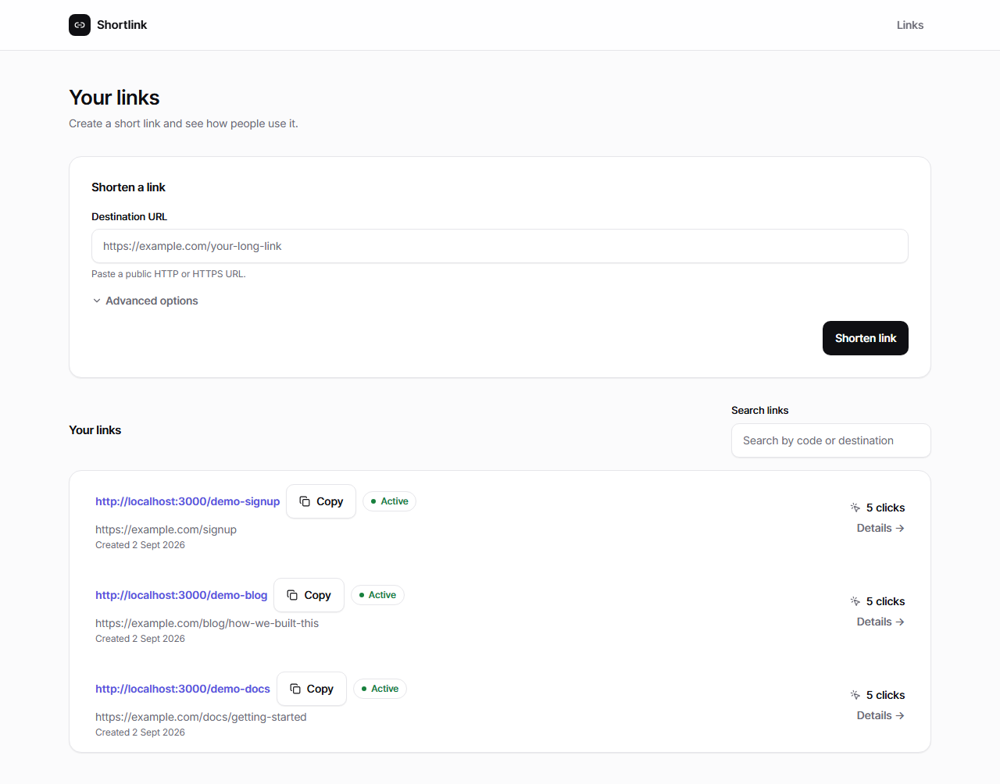
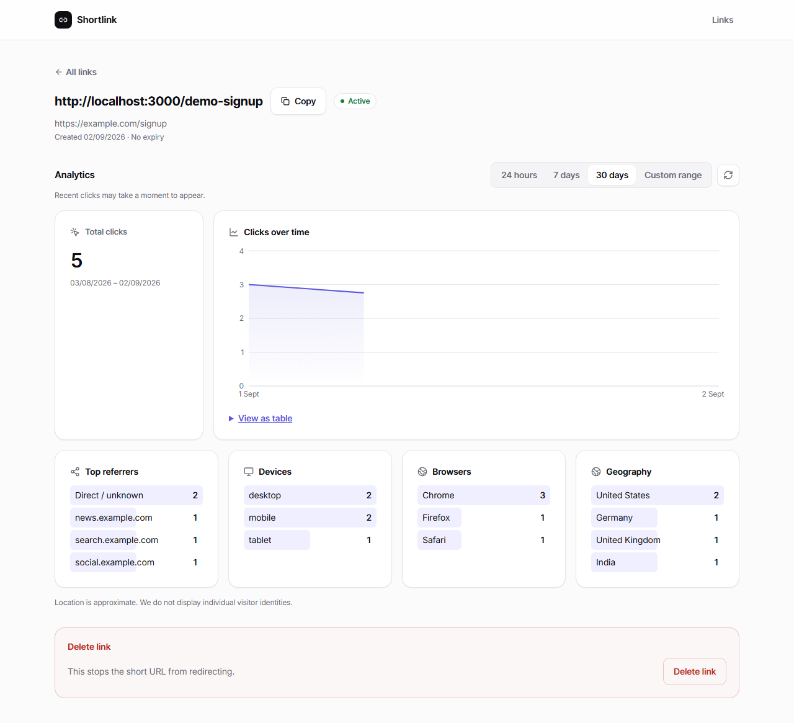

# URL Shortener with Analytics at Scale

A URL-shortening service built around one core idea: **redirects must stay fast, and
analytics must never slow them down.** Redirect resolution is a cache-first, low-latency
read path. Click analytics are captured asynchronously through a queue and processed by a
separate worker, so a slow database write or GeoIP lookup can never delay a visitor.

> **Project status:** All 8 phases of the implementation plan are complete: the full
> backend (link CRUD, cache-aside redirects, rate limiting, the BullMQ analytics pipeline,
> the analytics query API, and a checkpointed hourly/daily time rollup), a modern
> React/Tailwind dashboard — create a link, watch it appear in the list, open its
> analytics (live chart, breakdowns, accessible table alternative), and delete it with
> confirmation — operational hardening (structured logging with redaction, a `/metrics`
> endpoint, a controlled `503` on a database outage, and a fully containerized
> API/worker/web/Postgres/Redis stack verified end to end), and a recorded local benchmark
> proving the core architectural claim — a stopped analytics worker never affects redirect
> latency (see [Redirect performance benchmark](#redirect-performance-benchmark)). The
> remaining, deliberately-deferred work — dimension rollups, a retention job — is called
> out honestly in [Known limitations](#known-limitations-current-state), not hidden. See
> [Implementation status](#implementation-status) below.

Full product/technical documentation lives in [`docs/`](docs/):
[PRD](docs/01-prd.md) · [Technical specification](docs/02-technical-specification.md) ·
[App flow](docs/03-app-flow.md) · [Design specification](docs/04-design-specification.md) ·
[Database schema](docs/05-database-schema.md) ·
[Implementation plan](docs/06-implementation-plan.md) ·
[Agent to-do tracker](docs/07-agent-todo-tracker.md) ·
[Project rules](docs/08-project-rules.md).

## Architecture (target, per the technical specification)

```text
                       +--------------------+
                       |  React Dashboard   |
                       +----------+---------+
                                  |
                                  | HTTPS JSON API
                                  v
+----------+    GET /:code   +----------------------+       +-------------+
| Visitor  | --------------> | Express API service  | <-->  | PostgreSQL  |
+----------+                 | - redirect handler   |       | links/events|
                             | - management API     |       +-------------+
                             | - queue producer     |
                             +----+------------+----+
                                  |            |
                          cache lookup      enqueue event
                                  |            |
                                  v            v
                              +-------------------+
                              |       Redis       |
                              | cache + BullMQ    |
                              +---------+---------+
                                        |
                                        | consume
                                        v
                              +-------------------+
                              | Analytics worker  |
                              | UA + geo enrich   |
                              +---------+---------+
                                        |
                                        v
                                  +-------------+
                                  | PostgreSQL  |
                                  | click data  |
                                  +-------------+
```

Today, every portion of this diagram exists and runs — the API, PostgreSQL, Redis (cache,
rate limiter, and BullMQ), the analytics worker, the analytics query API, and the React
dashboard shown above it.

## Screenshots

The dashboard home — create a link, search/paginate the owner's list:



A link's detail page — total clicks, a live chart, and referrer/device/browser/geography
breakdowns:



Both were captured against real seeded data (`npm run seed`) in a real browser, not mocked
or hand-edited.

## Implementation status

| Area                                                                                    | Status                                                                                                                                |
| --------------------------------------------------------------------------------------- | ------------------------------------------------------------------------------------------------------------------------------------- |
| Repository layout, TypeScript, lint/format/test tooling                                 | Done                                                                                                                                  |
| Database migrations (`links`, partitioned `click_events`, dedupe, rollups, checkpoints) | Done                                                                                                                                  |
| Base62 short-code encoder/decoder                                                       | Done                                                                                                                                  |
| URL validation/normalization, alias validation, expiry validation                       | Done                                                                                                                                  |
| Owner-context (anonymous signed cookie)                                                 | Done                                                                                                                                  |
| Link create / list / get / delete (PostgreSQL only)                                     | Done                                                                                                                                  |
| Public redirect (`GET /:code`), 404/410 pages                                           | Done                                                                                                                                  |
| Health checks (`/health/live`, `/health/ready`)                                         | Done — reports PostgreSQL and Redis status separately                                                                                 |
| Redis cache-aside redirect (read-through + write-through, TTL bounded by expiry)        | Done                                                                                                                                  |
| Redis-backed creation rate limiting (fail-open on Redis outage)                         | Done                                                                                                                                  |
| BullMQ click-event queue (producer, on the redirect path)                               | Done — bounded 500ms publish budget; a queue failure never fails the redirect                                                         |
| Analytics worker (UA parsing, offline GeoIP, HMAC IP hashing, idempotent insert)        | Done                                                                                                                                  |
| Analytics query API (totals, timeline, referrer/device/browser/geography breakdowns)    | Done — reads raw `click_events` directly (see rollups row below)                                                                      |
| React/Tailwind dashboard (create, list/search, link detail + live chart, delete)        | Done — verified live in a real browser, including the full create → click → chart flow                                                |
| Time rollups (`click_rollups_time`, hourly + daily, checkpointed)                       | Done — see [Analytics rollups](#analytics-rollups)                                                                                    |
| Dimension rollups (`click_rollups_referrer`/`_device`/`_browser`/`_geography`)          | Not started — deliberately deferred; see [Analytics rollups](#analytics-rollups)                                                      |
| Structured request/worker logging with a redaction guard                                | Done — one log line per request; a field-name safety net redacts anything IP/cookie/secret-shaped regardless of call site             |
| `GET /metrics` (uptime, click-analytics queue depth and oldest-job age)                 | Done                                                                                                                                  |
| Controlled `503` on a database outage during a redirect (was a generic `500`)           | Done                                                                                                                                  |
| Docker images for API/worker/web, full container journey                                | Done — `docker compose up -d --build` builds and runs all five services; verified end to end (create → redirect → worker → analytics) |
| Local sample-data seed script (`npm run seed`)                                          | Done                                                                                                                                  |
| Retention/cleanup job for old partitions and dedupe rows                                | Not started — see [Backup, restore, and retention](#backup-restore-and-retention)                                                     |
| Load benchmarking                                                                       | Done — see [Redirect performance benchmark](#redirect-performance-benchmark)                                                          |

This matches the "foundation first" phased approach in
[the implementation plan](docs/06-implementation-plan.md): Phases 0–7 are complete — the
full create → redirect → analyze → delete journey works end to end, through a real
browser and through the fully containerized stack, without ever slowing down a redirect.
Benchmarking (Phase 8) comes next.

## Tech stack

- **Language:** TypeScript, strict mode, no `any`.
- **API:** Node.js + Express.
- **Database:** PostgreSQL 16+ (developed and tested against PostgreSQL 18 locally).
- **Cache / rate limiter / queue:** Redis 7, via [`ioredis`](https://github.com/redis/ioredis).
- **Analytics queue:** [BullMQ](https://docs.bullmq.io/) — a versioned job contract
  (`ClickEventJobPayloadV1`), 5 attempts with exponential backoff, and a separate
  `Worker` process (`apps/worker`) so a click-processing backlog can never slow a redirect.
- **User-agent parsing:** [`ua-parser-js`](https://github.com/faisalman/ua-parser-js) for
  device/browser classification; bot detection uses a small local keyword pattern rather
  than the library's own bot-detection submodule, which needs a newer module-resolution
  setting than the rest of this CommonJS project uses (see the comment in
  `apps/worker/src/enrichment/userAgentParser.ts`).
- **GeoIP:** [`geoip-lite`](https://github.com/geoip-lite/node-geoip) — a self-contained,
  offline dataset with no account, license key, or external network call per click.
  Country _names_ (not just codes) come from Node's built-in `Intl.DisplayNames`, so no
  second dataset is needed for that. Because of this choice, the `GEOIP_DATABASE_PATH`
  variable named in the technical specification's configuration contract does not apply
  and is not used.
- **Migrations:** [`node-pg-migrate`](https://github.com/salsita/node-pg-migrate), plain
  SQL inside JS migration files — no ORM.
- **Testing:** [Vitest](https://vitest.dev/) for unit and integration tests,
  [Supertest](https://github.com/ladjs/supertest) for HTTP-level tests against real test
  PostgreSQL, Redis, and BullMQ instances (not mocks) — including a full producer→worker
  round trip through a real queue. Test files run sequentially (not in parallel) — see
  the comment in `vitest.config.ts` for why. `REDIS_TEST_URL` points at a separate
  logical Redis database from `REDIS_URL`, so running tests never touches a locally
  running dev server's cache, rate limits, or queued jobs. Dashboard component tests use
  [Testing Library](https://testing-library.com/) + jsdom (opted into per file with a
  `// @vitest-environment jsdom` comment, since most of this project's tests are backend
  tests that should stay in the faster default `node` environment).
- **Linting/formatting:** ESLint (flat config, with `eslint-plugin-react-hooks` for the
  dashboard) + Prettier.
- **Dashboard (`apps/web`):** React 19 + [Vite](https://vite.dev/) +
  [React Router](https://reactrouter.com/) + [Tailwind CSS v4](https://tailwindcss.com/)
  (CSS-native `@theme` tokens, no separate JS config file — see
  `apps/web/src/styles/global.css`) + [Recharts](https://recharts.org/) for the clicks
  chart. No global state library: each page manages its own data with a small custom hook
  (`useLinkList`, `useLinkAnalytics`) calling a typed `apiClient` module, per the design
  spec's "do not introduce a global state library unless concrete interaction complexity
  proves it necessary."

### A note on the repository layout

The technical specification recommends an `apps/` + `packages/` monorepo laid out as npm
**workspaces**. This repository keeps that same folder layout (`apps/api`, `apps/worker`,
`apps/web`, `packages/shared`) for organizational clarity, but does **not** use npm
workspaces' symlinking mechanism — creating those symlinks failed on this development
machine because Windows Developer Mode is off, and turning on an OS-level developer
setting wasn't something to do without asking. Instead there is a single root
`package.json` with one `node_modules`, and shared code in `packages/shared` is imported
through a TypeScript path alias (`@shared/*` → `packages/shared/src/*`), resolved at
runtime by [`tsx`](https://github.com/privatenumber/tsx). Functionally this behaves the
same as a workspace for this project's needs, with one less moving part.

`apps/web`'s Vite config is named `vite.config.mts`, not `.ts`: because the root
`package.json` has no `"type": "module"`, Vite would otherwise try to load the config as
CommonJS, which fails for the (ESM-only) `@tailwindcss/vite` plugin. The `.mts` extension
tells Vite to load that one file as ESM regardless of the package's own module type.

## Local setup

### Prerequisites

- Node.js 20+
- A PostgreSQL 16+ server (this project was built against a **native Windows PostgreSQL
  18 install**, not Docker — see [Using Docker instead](#using-docker-instead))
- A Redis 7 server (this project runs it via **Docker Desktop** — `docker compose up -d
redis` — while PostgreSQL stays native; see below)

### 1. Install dependencies

```bash
npm install
```

### 2. Set up the database

This project was developed against a native PostgreSQL installation rather than Docker,
because Docker Desktop's daemon was not available in the development environment. A
`docker-compose.yml` is included (see [Using Docker instead](#using-docker-instead)) and
is the documented path for anyone who does have Docker running locally.

Whichever PostgreSQL you use, create two databases and a least-privilege application role
(never run the app as the `postgres` superuser):

```sql
CREATE ROLE url_shortener_app LOGIN PASSWORD 'choose-a-real-password';
CREATE DATABASE url_shortener_dev OWNER url_shortener_app;
CREATE DATABASE url_shortener_test OWNER url_shortener_app;
```

### 3. Configure environment variables

```bash
cp .env.example .env
```

Fill in real local values — most importantly `DATABASE_URL` (pointing at
`url_shortener_dev`), `DATABASE_TEST_URL` (pointing at `url_shortener_test`, used only by
the automated test suite), `IP_HASH_SECRET`, and `OWNER_COOKIE_SECRET`. Generate random
secrets with:

```bash
node -e "console.log(require('crypto').randomBytes(32).toString('hex'))"
```

The API validates every required variable at startup and fails fast with a specific,
readable message if one is missing — see `apps/api/src/config/environment.ts`.

### 4. Start Redis

```bash
docker compose up -d redis
```

This starts only the Redis service from `docker-compose.yml` (PostgreSQL stays native, as
set up in step 2). Confirm it's reachable:

```bash
docker exec url-shortener-redis redis-cli ping   # expect PONG
```

If `docker` isn't on your `PATH` even though Docker Desktop is running, it's likely
installed under `%LOCALAPPDATA%\Programs\DockerDesktop\resources\bin\docker.exe` rather
than the older `Program Files\Docker\Docker` location — call it by its full path, or add
that folder to `PATH`.

### 5. Run database migrations

```bash
npm run migrate:up
```

This creates the `links` table, the partitioned `click_events` table (with the current
month and two months ahead already created), the analytics event-deduplication table, and
the rollup/checkpoint tables. Run the same command against `DATABASE_TEST_URL` before
running the test suite the first time:

```bash
DATABASE_URL="$DATABASE_TEST_URL" npm run migrate:up
```

(On Windows PowerShell: `$env:DATABASE_URL=$env:DATABASE_TEST_URL; npm run migrate:up`.)

### 6. Run the API and the analytics worker

These are two separate processes; run each in its own terminal:

```bash
npm run dev:api
```

```bash
npm run dev:worker
```

The API listens on `PORT` (default `3000`). Try the whole pipeline:

```bash
curl -i -c cookies.txt -b cookies.txt -X POST http://localhost:3000/api/links \
  -H "Content-Type: application/json" \
  -d '{"longUrl":"https://example.com/articles/launch"}'

curl -i http://localhost:3000/<returned-short-code>
```

The redirect responds immediately. A moment later, the worker terminal logs
`"Processed a click-analytics job."`, and a row appears in `click_events`:

```bash
psql -U url_shortener_app -d url_shortener_dev \
  -c "SELECT event_id, short_code, device_type, browser_name, country_code, ip_hash FROM click_events ORDER BY occurred_at DESC LIMIT 5;"
```

Note that `ip_hash` is a hex digest, never the visitor's actual IP address.

### 7. Run the dashboard

In a third terminal:

```bash
npm run dev:web
```

Open **http://localhost:5173** (not port 3000 — that's the API). The dev server proxies
`/api` and `/health` requests to `http://localhost:3000`, so the browser only ever talks
to one origin and the owner-context cookie works normally. Create a link, click into it,
and its analytics page will show the same data you'd get from `curl`ing the analytics API
directly — including a live chart, once the worker (step 6) has processed a click or two.

Prefer not to click through the create form by hand? `npm run seed` inserts three
obviously-fake sample links with a handful of varied click events each (see
`scripts/seedSampleData.ts`), so the dashboard and analytics pages have something to look
at immediately. Safe to run more than once — it removes its own previously seeded rows
first.

### Using Docker for PostgreSQL too (without the app containers)

The day-to-day setup above runs Redis in Docker and PostgreSQL natively — that's what
this project actually runs on locally. If you'd rather run PostgreSQL in Docker as well
but still run the API/worker/web with `npm run dev:*` against it, `docker-compose.yml`
also defines a standalone `postgres` service:

```bash
docker compose up -d postgres redis
```

Update `.env` to match the compose file's credentials (`url_shortener_app` /
`local_dev_password_change_me`, database `url_shortener_dev`, host `localhost`) instead of
the native-install credentials from step 2, then run migrations and the API exactly as
above.

### Running the full stack in Docker (API, worker, web, PostgreSQL, Redis)

Every service is now containerized — `apps/api/Dockerfile`, `apps/worker/Dockerfile`, and
`apps/web/Dockerfile` — and `docker-compose.yml` wires all five services together with
health-check-gated startup ordering (the API and worker both wait for PostgreSQL and Redis
to report healthy before starting).

```bash
docker compose up -d --build
```

This builds and starts `postgres`, `redis`, `api` (port `3000`), `worker` (no exposed
port — it only consumes queue jobs), and `web` (port `8080`, nginx serving the built React
app and proxying `/api` and `/health` to the `api` service, mirroring
`apps/web/vite.config.mts`'s dev proxy). The `api` and `worker` images run their
TypeScript source directly through `tsx` rather than a separate compile step — the same
way `npm run dev:api` does — which keeps one simple, well-understood run path everywhere
at the cost of a larger image (dev dependencies are included; see the header comment in
`apps/api/Dockerfile` for the trade-off).

The Postgres container starts with an empty database — migrations are not run
automatically, on purpose (a fresh empty database is a safer default than accidentally
running migrations against a volume that already has real data). Run them once, from
inside the `api` container so they always target this exact deployed schema version:

```bash
docker compose exec api npm run migrate:up
docker compose exec api npm run maintain:partitions
docker compose exec api npm run rollup:run
```

Then visit **http://localhost:8080**. To seed the dashboard with sample data for a quick
look instead of starting from an empty list:

```bash
docker compose exec api npm run seed
```

This whole flow (build → migrate → create a link → redirect → worker processes it →
analytics show the click) was verified locally end to end, including confirming the
`web` container's nginx correctly proxies `/api` requests and falls back to `index.html`
for a client-side route like `/links/abc123`.

To stop everything: `docker compose down` (add `-v` to also delete the Postgres/Redis
volumes, which deletes all data — see [Backup, restore, and
retention](#backup-restore-and-retention) before doing that against anything you care
about).

## Running quality checks

```bash
npm run format:check   # Prettier
npm run lint           # ESLint
npm run typecheck      # tsc --noEmit
npm test                # Vitest — unit tests plus integration tests against DATABASE_TEST_URL
```

All four must pass before a change is considered complete, per the project rules.
Integration tests require a running, migrated `url_shortener_test` database **and** a
running Redis reachable at `REDIS_TEST_URL` (a separate logical database from
`REDIS_URL`, so tests never touch a dev server's cache, rate limits, or queued jobs).
They truncate/flush that isolated test data between tests — never point
`DATABASE_TEST_URL` or `REDIS_TEST_URL` at data you care about.

### Partition maintenance

`click_events` is partitioned by month. Migrations create the current month plus two
months ahead; run this periodically (for example, monthly, from a scheduled job) to keep
that horizon from running out:

```bash
npm run maintain:partitions
```

It is idempotent — safe to run repeatedly.

### Rollup maintenance

```bash
npm run rollup:run
```

Recomputes the hourly and daily `click_rollups_time` rows for a recent overlap window (see
[Analytics rollups](#analytics-rollups)) and exits. Also idempotent — run it on a schedule
(every 15–30 minutes is reasonable) from the same kind of external scheduler as partition
maintenance; this project does not run a persistent rollup daemon.

## API overview

All management endpoints are under `/api` and require the anonymous owner-context cookie
(set automatically on first request). The public redirect route is registered last, after
every reserved path, so `api`, `health`, and other reserved words can never be interpreted
as a short code.

| Method   | Path                         | Purpose                                                                                                                                                                                                                                                                                                                                                                                                                   |
| -------- | ---------------------------- | ------------------------------------------------------------------------------------------------------------------------------------------------------------------------------------------------------------------------------------------------------------------------------------------------------------------------------------------------------------------------------------------------------------------------- |
| `POST`   | `/api/links`                 | Create a link (generated code or custom alias); returns an existing link instead of a duplicate by default. Rate-limited per owner (`429` + `Retry-After` once exceeded); the public redirect route below is never subject to this limit.                                                                                                                                                                                 |
| `GET`    | `/api/links`                 | List the current owner's active links, newest first, with cursor pagination and optional search.                                                                                                                                                                                                                                                                                                                          |
| `GET`    | `/api/links/:code`           | Read one owned link's metadata and click count.                                                                                                                                                                                                                                                                                                                                                                           |
| `DELETE` | `/api/links/:code`           | Soft-delete an owned link. Idempotent; returns a generic 404 for a link you don't own.                                                                                                                                                                                                                                                                                                                                    |
| `GET`    | `/api/links/:code/analytics` | Totals, timeline, and referrer/device/browser/geography breakdowns for an owned link. See [Analytics query API](#analytics-query-api) below.                                                                                                                                                                                                                                                                              |
| `GET`    | `/:code`                     | Public redirect. Cache-aside: checks Redis first, falls back to PostgreSQL on a miss or Redis error, and backfills the cache. On success, also publishes a click-analytics job to BullMQ (bounded to a 500ms budget; a queue failure or timeout never blocks the redirect). `302` on success, `404` for unknown/deleted, `410` for expired. Add `Accept: application/json` for a JSON error body instead of an HTML page. |
| `GET`    | `/health/live`               | Liveness — process is responding. Never touches a dependency.                                                                                                                                                                                                                                                                                                                                                             |
| `GET`    | `/health/ready`              | Readiness — `{ "status": "ok" \| "unavailable", "dependencies": { "database": "ok" \| "unavailable", "cache": "ok" \| "degraded" } }`. Only a PostgreSQL failure returns `503`; Redis being down is reported as `"degraded"` but does not fail readiness, since redirects still work (just slower) without it.                                                                                                            |
| `GET`    | `/metrics`                   | Process uptime and click-analytics queue depth (`waitingJobs`, `activeJobs`, `delayedJobs`, `failedJobs`, `completedJobs`, `oldestWaitingJobAgeSeconds`) as JSON.                                                                                                                                                                                                                                                         |

Every error response has the shape:

```json
{
  "error": {
    "code": "VALIDATION_ERROR",
    "message": "...",
    "details": [{ "field": "longUrl", "message": "..." }],
    "requestId": "req_..."
  }
}
```

### Analytics query API

`GET /api/links/:code/analytics` accepts four optional query parameters:

| Param      | Default                            | Notes                                                                                                                                                                             |
| ---------- | ---------------------------------- | --------------------------------------------------------------------------------------------------------------------------------------------------------------------------------- |
| `from`     | 30 days before `to`                | ISO-8601 timestamp.                                                                                                                                                               |
| `to`       | now                                | ISO-8601 timestamp. `from` must be before `to`, and the range cannot exceed 90 days.                                                                                              |
| `bucket`   | `hour` for ranges ≤48h, else `day` | An explicit `hour` request is overridden to `day` if the range would produce too many points.                                                                                     |
| `timezone` | `UTC`                              | Any IANA zone name (validated against the JS runtime's own timezone database). Affects how timeline buckets are aligned, not how the range boundaries themselves are interpreted. |

Ownership is checked **before** any analytics query runs — an unowned or unknown code
returns a generic `404` without ever touching `click_events`. Response shape:

```json
{
  "data": {
    "link": { "shortCode": "w7e", "shortUrl": "...", "longUrl": "..." },
    "range": { "from": "...", "to": "...", "timezone": "UTC", "bucket": "day" },
    "totalClicks": 42,
    "timeline": [{ "bucketStart": "...", "clickCount": 5 }],
    "referrers": [{ "name": "news.example.com", "clickCount": 20 }],
    "devices": [{ "name": "mobile", "clickCount": 30 }],
    "browsers": [{ "name": "Chrome", "clickCount": 25 }],
    "geography": [{ "country": "United States", "city": "Chicago", "clickCount": 10 }],
    "freshness": { "isEventuallyConsistent": true, "lastRollupAt": null }
  }
}
```

Notes:

- **This endpoint always reads raw `click_events` directly**, not rollups — correct at
  every scale this project has actually been tested at; see [Analytics
  rollups](#analytics-rollups) for what rollups exist and why the read path doesn't use
  them yet. `freshness.lastRollupAt` reports when the hourly time rollup last completed
  (or `null` if it has never run) — informational metadata about the rollup job, not about
  this response's own data. `isEventuallyConsistent` is always `true`, honestly reflecting
  that the worker may not have finished processing the most recent clicks yet.
- **Geography is privacy-thresholded.** A city with fewer than 3 events in the requested
  range is folded into its country (`city: null`) rather than shown on its own — a
  handful of clicks from one named city could otherwise identify a specific small group
  of visitors. Two suppressed cities in the same country are merged into one row with
  their counts summed, not dropped.
- **Bucket timestamps are computed in the requested timezone, not the database server's
  local timezone.** This was an actual bug caught by the test suite during development:
  `date_trunc('day', occurred_at)` alone truncates using the Postgres session's own
  timezone setting, which is not necessarily UTC. The query now explicitly converts to
  the requested zone, truncates, and converts back (`AnalyticsRepository.getTimeline`),
  matching the pattern in `database-schema.md` Section 14.2.

## Analytics rollups

`docs/06-implementation-plan.md` Section 10.3's rollout policy for rollups is explicit:
"start simple and correct" — use raw events until a large or repeated-range query actually
needs rollups, and never build a rollup that can't be recomputed from raw events. Here is
exactly what that means has and hasn't been built:

**Implemented: the time rollup (`click_rollups_time`), hourly and daily.**

- `RollupRepository.upsertTimeRollupsForWindow` (`apps/api/src/repositories/rollupRepository.ts`)
  groups a window of raw `click_events` by link and UTC-truncated bucket and upserts the
  result — safe to run repeatedly, since `ON CONFLICT` overwrites each row with its
  freshly recomputed count rather than adding to it.
- `RollupService` (`apps/api/src/services/rollupService.ts`) computes a **recent overlap
  window** for each run — the current, still-in-progress bucket plus 3 hours (hourly) or 2
  days (daily) of history — and recomputes the whole thing every time. This is what makes
  a late-arriving event (one that hit BullMQ's retry backoff, for example) get folded into
  the correct rollup row the next run, rather than being permanently missed because its
  bucket was already considered "done." After each run it records a checkpoint in
  `analytics_rollup_checkpoints` (`hourly_time` / `daily_time`) — freshness reporting, not
  a correctness gate: the repository always recomputes its full window from raw events
  regardless of what the checkpoint says.
- Run it with `npm run rollup:run` (see [Rollup maintenance](#rollup-maintenance)) — a
  short-lived script meant for an external scheduler, the same pattern as
  `maintain:partitions`, not a persistent daemon.
- Verified with repeatable integration tests, not a one-time successful run:
  `rollupRepository.test.ts` covers per-link grouping, idempotency (running twice produces
  the same final count, not double the count), a simulated late event actually updating an
  already-rolled-up bucket, and window boundaries being respected; `rollupService.test.ts`
  covers the checkpoint being written and the hourly/daily jobs never sharing one.

**Not implemented: the dimension rollups** (`click_rollups_referrer`, `_device`,
`_browser`, `_geography`) **and switching `AnalyticsService` to read from rollups.** Both
are deliberately deferred, for reasons specific to each:

- The dimension rollup tables already exist (from the schema migration) and could be
  populated the same way `click_rollups_time` is, but the rollout policy gates that on
  "query plans or benchmark results" justifying it — this project's dimension breakdown
  queries have stayed fast on raw events at every scale actually tested (see the [redirect
  performance benchmark](#redirect-performance-benchmark) — a different query path, but the
  same underlying table and indexes), so there is no such evidence yet.
- Switching the analytics API's read path is not just a table swap: `AnalyticsRepository.getTimeline`
  buckets in the _requester's_ timezone, while rollups are always stored in UTC (per
  database-schema.md Section 15.2 — "mixing user-specific local buckets into globally
  stored daily rollups creates complexity and inconsistent totals"). Doing this correctly
  needs a genuine hybrid-range strategy: recent, still-settling buckets read from raw
  events, older UTC-safe buckets read from rollups. That's a real, separate piece of work
  with its own correctness risk, not something to bolt on without the benchmark evidence
  that motivates it.

## Privacy and security behavior implemented so far

- Only `http:`/`https:` destination URLs are accepted; `javascript:`, `data:`, `file:`,
  and URLs with embedded credentials are rejected server-side.
- The owner-context cookie is `HttpOnly`, signed, `SameSite=Lax`, and `Secure` in
  production; it is never exposed in any API response body.
- **No dedicated CSRF token, by design rather than by omission.** `SameSite=Lax` already
  means the owner cookie is not sent on a cross-site state-changing request, and there is
  no CORS middleware anywhere in the stack — the browser only ever talks to the single
  origin the dashboard was served from (see `apps/web/vite.config.mts`'s dev proxy and
  `apps/web/nginx.conf`'s production proxy), so a script on another origin cannot make an
  authenticated JSON request here even if it tried. `helmet()` sets the usual security
  headers, and `express.json()` is capped at `10kb` per request body.
- Express's `trust proxy` setting is deliberately left unconfigured: `request.ip` in
  `RedirectController` is the direct socket address, not an attacker-controllable header.
  A real deployment behind a reverse proxy/load balancer must configure this explicitly
  before trusting `X-Forwarded-For` — see the comment at the `request.ip` usage site.
- Cross-owner management requests (reading or deleting another owner's link) return a
  generic `404`, never revealing that the code belongs to someone else.
- All SQL is parameterized; nothing user-supplied is concatenated into a query.
- Error responses never include stack traces, SQL errors, or internal configuration —
  only a stable error code, a safe message, and a request ID for support correlation.
- Link creation is rate-limited per owner (20 requests / 15 minutes by default, both
  configurable). A Redis outage fails the rate limiter **open** (creation is allowed
  through) rather than blocking the product because an optimization is down — see the
  trade-off comment in `apps/api/src/cache/creationRateLimiter.ts`.
- Redis is never a single point of failure for a redirect: every cache read/write/delete
  catches its own errors and falls back to PostgreSQL, and no cached value ever contains
  an owner ID or other private field (only `linkId`, `shortCode`, `longUrl`, `expiresAt`,
  `redirectStatusCode` — see `RedirectCachePayload`).
- **Raw client IP addresses are never persisted.** The worker computes an HMAC-SHA-256
  hash (`IP_HASH_SECRET`, keyed by `IP_HASH_KEY_VERSION` for future rotation) and stores
  only that hash plus its key version; the raw address is never written to the database
  or to any log line. `click_events` has no column that could even hold one. Verified by
  a dedicated test in `apps/worker/src/enrichment/ipHasher.test.ts` and by inspecting the
  actual row in `apps/worker/src/repositories/clickEventRepository.test.ts`.
- The redirect handler itself never parses a user agent, calls GeoIP, or writes a click
  row — only the worker does. A queue publish failure or timeout (bounded to 500ms) is
  logged and counted but never fails the redirect, and a malformed queued job is
  discarded (BullMQ `UnrecoverableError`, no retry) rather than retried forever or
  silently accepted.
- **A PostgreSQL outage on a redirect cache miss returns a controlled `503`, never an
  unsafe or wrong redirect.** `RedirectService.resolveShortCode` used to let a raw
  database error bubble up as a generic `500`; it now catches that failure and throws
  `ServiceUnavailableError` specifically, so the client gets the documented, stable
  `SERVICE_UNAVAILABLE` error code instead. Covered by
  `apps/api/src/services/redirectService.test.ts`.
- **Every log line goes through a redaction guard before it is written.** Both the API's
  and worker's loggers (`observability/logger.ts`) refuse to log the _value_ of any field
  whose _name_ looks sensitive (`ip`, `cookie`, `password`, `secret`, `token`,
  `authorization`, etc.) — replacing it with `[REDACTED]` — as a last-line-of-defense
  safety net beyond each call site already avoiding these fields on purpose. Fixing this
  also surfaced and fixed a real, separate bug: a caller passing a field literally named
  `message` (very common, since it's usually an error's own `.message`) used to silently
  overwrite the actual log message text instead of just losing that one field; the logger
  now guarantees `level`/`message`/`timestamp` always win. Covered by
  `observability/logger.test.ts` in both `apps/api` and `apps/worker`.
- **Every request is logged as one structured line** (method, path — never the query
  string, since it may carry analytics search values — status code, duration, and the
  request ID that ties it to any error response the client saw), via
  `apps/api/src/middleware/requestLoggingMiddleware.ts`.
- **`GET /metrics`** reports process uptime and click-analytics queue depth (waiting,
  active, delayed, failed, completed job counts, and the oldest waiting job's age in
  seconds) — the queue-backlog signal an operator would actually want on a dashboard or
  alert, and the piece explicitly deferred from the original queue-pipeline phase to this
  hardening phase.

Analytics _retention_ policy (how long raw events, rollups, and dedupe rows are kept) is
documented in the [database schema](docs/05-database-schema.md) but not yet implemented
as an actual cleanup job — see [Implementation status](#implementation-status) and
[Backup, restore, and retention](#backup-restore-and-retention) below.

## Backup, restore, and retention

This project does not yet run in a real hosted environment, so there is no live backup
schedule to document — the notes below are the procedure to follow once it does, using
standard PostgreSQL tooling rather than anything custom-built.

**Backup** — a logical dump via `pg_dump` is sufficient at this project's scale and is
simplest to restore selectively:

```bash
pg_dump --format=custom --file=url_shortener_backup.dump "$DATABASE_URL"
```

Run this on a schedule appropriate to how much data loss would be acceptable (for
example, daily); store the dump somewhere other than the same disk as the database itself.
`click_events` is the largest and fastest-growing table (it is time-partitioned — see
`database/migrations` and `scripts/create-future-click-event-partitions.ts` — specifically
so that old partitions can eventually be archived or dropped independently of the rest of
the schema, once a retention job exists).

**Restore** — into an empty, already-migrated database (run `npm run migrate:up` first,
so extensions/enums/roles created outside of `pg_dump`'s scope already exist), then:

```bash
pg_restore --dbname="$DATABASE_URL" --clean --if-exists url_shortener_backup.dump
```

Always restore-test a backup somewhere other than production before trusting it — a backup
that was never restored is unverified.

**Redis** — deliberately holds no data that must survive a restart. The redirect cache
is a read-through cache PostgreSQL can always repopulate; the click-analytics queue's jobs
are only in-flight work (a lost queued job means, at worst, a handful of clicks are never
recorded — nothing about redirect correctness depends on it). Redis is not part of this
project's backup story.

**Retention** — not yet an automated job (see [Known limitations](#known-limitations-current-state)).
The intended shape, per `docs/05-database-schema.md`, is a scheduled job that drops
`click_events` partitions and `analytics_event_deduplication` rows older than a configured
window, and prunes `click_rollups_*` rows once rollups themselves exist. Until that job is
built, storage grows unbounded and an operator should watch disk usage manually.

## Redirect performance benchmark

**Recorded 2026-09-02, on the developer's own machine — not production hardware.** These
numbers describe how this specific single-process Node API behaves on a laptop under
`autocannon` load, not what a real deployment would achieve. Every number below comes from
an actual recorded run (see the exact `autocannon` commands under each scenario); none are
estimated or copied from documentation.

**Environment:** Windows 11, Intel Core i5-12450HX (12 logical cores), 15.7 GB RAM,
Node.js v24.14.1, single API process (`npm run dev:api`, no clustering), single worker
process (concurrency 10), PostgreSQL native install, Redis in Docker — i.e. the same local
setup described above, not a tuned production topology. `autocannon` ran on the same
machine as the server, so results include no network latency but do share CPU with the
server process itself.

**Method:** created one dedicated link (`benchmark-redirect`) via the real `POST
/api/links` endpoint, warmed its cache entry with one request, then ran each scenario 3
times back to back and report the range rather than a single cherry-picked run. All
`3xx`/`2xx` categorization below comes from each run's `statusCodeStats` (every response
in every scenario was a `302`).

### Baseline (warm cache)

```bash
npx autocannon -c 50 -d 15 http://localhost:3000/benchmark-redirect
```

| Run | Requests | RPS (avg) | p50  | p90  | p97.5 | p99  | max   | Errors |
| --- | -------- | --------- | ---- | ---- | ----- | ---- | ----- | ------ |
| 1   | 24,986   | 1,666     | 28ms | 35ms | 48ms  | 57ms | 156ms | 0      |
| 2   | 25,421   | 1,695     | 28ms | 34ms | 40ms  | 45ms | 84ms  | 0      |
| 3   | 25,769   | 1,718     | 28ms | 33ms | 38ms  | 40ms | 48ms  | 0      |

Consistent across runs: ~1,700 requests/second sustained at 50 concurrent connections,
p50 latency a stable 28ms, zero errors or timeouts in any run.

### Burst (high concurrency)

```bash
npx autocannon -c 300 -d 10 http://localhost:3000/benchmark-redirect
```

| Run | Requests | RPS (avg) | p50   | p90   | p97.5 | p99   | max   | Errors |
| --- | -------- | --------- | ----- | ----- | ----- | ----- | ----- | ------ |
| 1   | 17,776   | 1,778     | 164ms | 198ms | 230ms | 240ms | 243ms | 0      |
| 2   | 18,544   | 1,855     | 158ms | 184ms | 209ms | 230ms | 234ms | 0      |
| 3   | 18,658   | 1,866     | 159ms | 173ms | 182ms | 219ms | 223ms | 0      |

Throughput at 300 connections is roughly the same as (or slightly above) the 50-connection
baseline — this single Node process's event loop is the bottleneck, not the database or
Redis — while p50 latency rises from ~28ms to ~160ms as requests queue up behind it.
**Resource usage during a monitored burst run** (sampled via `Get-Process` every second):
API process CPU time increased by ~7.0 seconds over a ~10.2 second run (≈69% of one
logical core — this is a single-threaded JS process, so it cannot exceed ~100% of one
core no matter how many are available) and working-set memory stayed flat at ~231–232MB
with no growth across the run, i.e. no indication of a memory leak under sustained load.

### Cold lookup (cache miss)

```bash
docker exec url-shortener-redis redis-cli del "redirect:link:benchmark-redirect"
curl -w "%{time_total}s\n" http://localhost:3000/benchmark-redirect   # forces a PostgreSQL fallback + cache backfill
```

A single deliberately-cleared cache key, measured with `curl`'s own timing, then compared
to the very next request against the now-repopulated cache:

| Run | Cold miss (PostgreSQL fallback) | Immediate re-hit (from cache) |
| --- | ------------------------------- | ----------------------------- |
| 1   | 75ms                            | 7ms                           |
| 2   | 7ms                             | 9ms                           |
| 3   | 8ms                             | 6ms                           |

Only the very first miss after the API process had been idle showed a real penalty (75ms);
later misses were nearly as fast as a cache hit, because PostgreSQL's own query plan and
connection were already warm — the single-row indexed lookup by `short_code` is simply
fast once warmed, cache or no cache.

**Cold cache under concurrent load** (thundering herd): clearing the cache key and
immediately firing 50 concurrent connections for 3 seconds produced 3,611 successful
redirects, 0 errors, 0 timeouts — but a p99 of 174ms and a max of 626ms, notably worse than
either the warm baseline or a single cold request. This is because `RedirectService` has
no single-flight/request-coalescing protection against a cache-miss stampede: many
concurrent requests for the same just-evicted key can each independently query PostgreSQL
and each independently write the cache back, instead of one request doing the work and the
rest waiting on it. No requests failed, but see [Known limitations](#known-limitations-current-state).

### Queue degraded (worker stopped)

Stopped the analytics worker process entirely, then ran the same baseline load
(`-c 50 -d 10`) against the redirect route:

| Requests | RPS (avg) | p50  | p90  | p97.5 | p99  | max  | Errors |
| -------- | --------- | ---- | ---- | ----- | ---- | ---- | ------ |
| 25,773   | 2,578     | 11ms | 36ms | 43ms  | 46ms | 63ms | 0      |

Redirect performance was **unaffected** by the worker being completely stopped — if
anything, slightly faster, since the worker was no longer competing for the same
PostgreSQL connections. `GET /metrics` confirmed the click-analytics queue correctly
absorbed all 25,773 jobs as `waitingJobs` with zero enqueue failures. Restarting the worker
(concurrency 10) drained that entire backlog to zero in about 20–25 seconds, confirming
recovery is not just non-blocking but fast once the worker comes back — this is the
concrete evidence behind this project's core architectural claim: **a stopped or degraded
analytics worker never affects redirect availability or latency.**

## Trade-offs and future scale path

A few deliberate simplicity choices, and what would change first if this needed to handle
real production traffic — see `docs/02-technical-specification.md` Section 9.5 for the
original, more detailed version this summarizes:

- **Single Node process, no clustering.** The benchmark above shows this project's
  event loop is the bottleneck at high concurrency, not PostgreSQL or Redis. The first
  scale step is horizontal — run several API instances behind a load balancer (Node's own
  `cluster` module or a process manager would work too) — not a code rewrite, because the
  redirect path already has no per-instance state (the owner cookie is signed and
  stateless; the cache lives in Redis, not in-process).
- **A hot short code could still bottleneck a single Redis key.** If a viral link's cache
  key becomes the bottleneck, the documented next steps are (in order): measure the actual
  hot-key traffic and Redis command latency first, then add a small bounded in-process LRU
  cache with a short TTL in front of Redis, then move to Redis replicas/cluster, then
  consider deploying redirect service instances nearer to traffic sources. Edge caching is
  deliberately last on that list — its expiry/invalidation guarantees need to be worked
  out carefully before adopting it, not reached for first.
- **No single-flight cache-miss coalescing yet** (see [Known
  limitations](#known-limitations-current-state) below) — the natural next step if the
  thundering-herd tail latency in the benchmark above ever matters at real traffic.
- **The analytics API reads raw `click_events` directly, not the time rollup that now
  exists.** Correct and fast enough at this project's tested scale; a large/repeated-range
  query actually being slow is the trigger for building the hybrid raw/rollup read path —
  see [Analytics rollups](#analytics-rollups) for exactly why that's a separate piece of
  work, not just a table swap.
- **A fixed-window rate limiter, not a sliding one.** Chosen because the creation
  endpoint's abuse control only needs to be roughly right, not exact — a burst spanning
  two windows could briefly exceed the configured limit, which is an acceptable trade-off
  for the complexity a true sliding window would add.

## Known limitations (current state)

- **The dashboard bundle is not code-split.** Recharts pushes the built bundle past Vite's
  default 500KB warning threshold; acceptable for a project this size, worth splitting via
  dynamic `import()` if the dashboard grows. (The dashboard _is_ now containerized and
  production-built — see [Running the full stack in
  Docker](#running-the-full-stack-in-docker-api-worker-web-postgresql-redis).)
- **No public 404/410 pages in the React app.** They don't need to exist there: a bad
  short code never reaches the SPA at all — the API renders the (already-implemented,
  already-tested) HTML error page directly for `GET /:code`, per Rule G-04's status as
  handled by Phase 2, not Phase 6.
- **Dimension rollups don't exist yet, and the analytics API doesn't read from rollups at
  all.** See [Analytics rollups](#analytics-rollups) for exactly what is and isn't built
  and why — the time rollup itself is implemented, tested, and schedulable.
- **No retention/cleanup job yet.** Old partitions, dedupe rows, and events are not
  automatically pruned.
- **Rate limiter is a fixed window, not a true sliding window.** A burst spanning two
  windows could briefly exceed the configured limit. Documented and accepted as a
  simplicity trade-off for an abuse control that only needs to be roughly right — see the
  comment in `apps/api/src/cache/creationRateLimiter.ts`.
- **Bot detection is a keyword heuristic, not `ua-parser-js`'s own bot-detection module.**
  See the comment in `apps/worker/src/enrichment/userAgentParser.ts` for why (a package
  subpath import that needs a module-resolution setting this project doesn't use).
- **No single-flight protection against a cache-miss thundering herd.** If many concurrent
  requests arrive for the same short code right after its cache entry expires or is
  evicted, each one independently queries PostgreSQL and independently writes the cache
  back, instead of one request doing the work while the rest wait on it. Confirmed via the
  benchmark above: no requests failed, but tail latency (p99/max) was noticeably worse
  than either a warm cache or a single isolated cold miss. Correct behavior either way —
  every request still gets the right answer — just not the most efficient one under that
  specific condition. Worth adding request coalescing (for example via a short-lived
  in-flight-request map, or a Redis lock) if this pattern shows up at real traffic volumes.
- **Dependency audit:** `npm audit` reports 7 advisories, all rooted in two transitive
  packages: `esbuild` (pulled in by Vite/Vitest's dev toolchain) and `glob` (pulled in by
  `node-pg-migrate`'s CLI). Neither is imported by the API/worker/web _application code_
  at runtime — `esbuild`'s advisory is specifically about its own local dev server
  accepting requests from any website, and `glob`'s is a command-injection risk in its own
  CLI, not something reachable through this project's code. They were left unpatched
  rather than forcing the breaking major-version upgrades `npm audit fix --force` would
  apply (Vite 8, `node-pg-migrate` 9) without testing them. One honest caveat: the API and
  worker Docker images run `npm ci` without `--omit=dev` (see [Running the full stack in
  Docker](#running-the-full-stack-in-docker-api-worker-web-postgresql-redis) for why —
  `tsx` itself is a dev dependency), so these packages are physically present inside the
  built images even though the running application never calls into them. Revisit before
  a real deployment, and prefer `--omit=dev` plus a genuine compiled-JS build step if image
  contents need to be minimal.

## Release checklist

Per `docs/06-implementation-plan.md` Section 20, checked only once genuinely verified —
not assumed:

- [x] Database migrations and partition maintenance are verified — run for real against a
      fresh containerized PostgreSQL (see [Running the full stack in
      Docker](#running-the-full-stack-in-docker-api-worker-web-postgresql-redis)), and both
      `scripts/create-future-click-event-partitions.ts` and `scripts/runAnalyticsRollup.ts`
      confirmed idempotent (the latter also run for real against the dev database, plus
      repeatable integration tests — see [Analytics rollups](#analytics-rollups)).
- [x] Generated base62 links and custom aliases work under concurrent requests —
      covered by `linkRepository.test.ts`'s concurrent-ID-allocation test.
- [x] Redirect cache-aside path works with safe PostgreSQL fallback — covered by
      `app.test.ts`'s "serves from cache even after the database row is deleted" test, and
      exercised for real in the [cold lookup benchmark](#redirect-performance-benchmark).
- [x] Redirect does not wait for analytics worker processing — proven by the [queue
      degraded benchmark](#redirect-performance-benchmark): redirect latency was
      unaffected (if anything, faster) with the worker completely stopped.
- [x] Analytics queue/worker is idempotent and privacy-preserving — dedupe-claim-then-insert
      covered by `clickEventProcessor.test.ts`; raw IP never persisted, covered by
      `ipHasher.test.ts` and a direct row inspection in `clickEventRepository.test.ts`.
- [x] Owner-only link management and analytics access are enforced — cross-owner requests
      return a generic 404, covered in `app.test.ts`.
- [x] Dashboard implements the approved design and accessibility requirements — see
      `docs/04-design-specification.md`'s Section 18 acceptance checklist and the
      Testing-Library-based component tests.
- [x] Docker Compose supports the full local journey — verified live: build, migrate,
      create a link, redirect, worker processes it, analytics visible, all through the
      `web` container's nginx proxy.
- [x] Health, logs, and metrics are present and safe — `/health/live`, `/health/ready`,
      `/metrics`; every log line passes through the redaction guard described in [Privacy
      and security behavior](#privacy-and-security-behavior-implemented-so-far).
- [x] Load benchmark evidence is recorded — see [Redirect performance
      benchmark](#redirect-performance-benchmark), every number cited to an actual run.
- [x] README and all project docs match the implementation — the [Implementation
      status](#implementation-status) table and [Known limitations](#known-limitations-current-state)
      section are kept current with every phase, including this one.
- [x] No secrets, raw IP addresses, fabricated benchmark values, or undocumented shortcuts
      remain — `.env` was never committed (confirmed via `git ls-files`); every benchmark
      number above cites its own recorded run; every known shortcut or trade-off is called
      out explicitly rather than left silent.

Everything in this checklist is verified as of the commit that introduced this section.
A version tag has not been created yet — that is a deliberate choice left to the project
owner, not an oversight, since choosing a version number and cutting a release is a
product decision rather than a technical one.

No performance claim is made yet; no benchmark has been run. That happens in a later
phase per the implementation plan, and only measured, reproducible numbers will be
recorded here.
