# System Design Document

## 1. Document Control

| Field | Value |
| --- | --- |
| Product | ZipLink |
| Document | System Design Document |
| Version | 1.0 |
| Related documents | `01-prd.md`, `02-technical-specification.md`, `03-app-flow.md`, `04-design-specification.md`, `05-database-schema.md`, `09-technical-reference.md` |

## 2. Purpose and how to read this document

This document is the single place that explains **why ZipLink is built the way it is** — not just what each piece does, but the reasoning behind every major structural decision, the alternatives that were considered and rejected, and the trade-offs accepted along the way. The other numbered docs describe individual subsystems (the database schema, the API contract, the UI spec); this one is the map that ties them together and, more importantly, argues for the shape of the map itself.

It assumes no prior context. If you have never seen this codebase before, reading this document top to bottom should leave you able to answer: what are the moving parts, how does a request actually travel through them, why does each boundary exist where it does, and what would have to change if a specific assumption stopped holding (10x traffic, a second region, a compliance requirement).

Every diagram in this document is written in [Mermaid](https://mermaid.js.org/) syntax. Paste any code block into the [Mermaid Live Editor](https://mermaid.live) to render and explore it interactively, or view it directly if your Markdown renderer supports Mermaid natively (GitHub does).

## 3. The one sentence version

ZipLink is a URL shortener where **redirects and analytics are structurally incapable of blocking each other**, because they run in two separate processes that only communicate through a message queue — and where **account ownership is a thin, additive layer** on top of an ownership abstraction that already existed for anonymous users, so adding accounts required touching almost nothing in the link/analytics code that predates it.

Those two sentences are the two biggest design decisions in the whole system, and nearly everything else in this document either implements them or exists in service of them.

## 4. High-level architecture

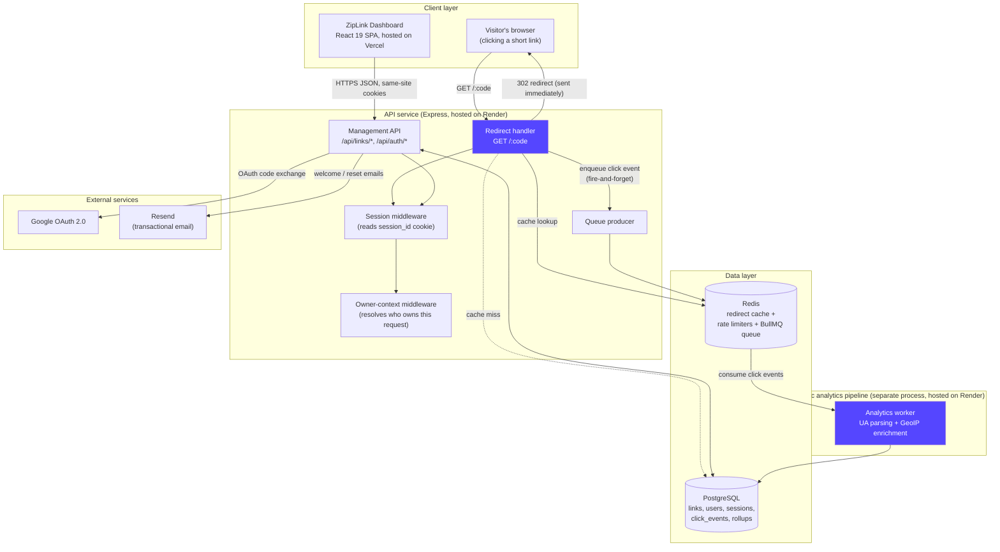

**Reading this diagram:** the visitor's browser only ever talks to the redirect handler; it never sees the management API, the worker, or the database directly. The dashboard only ever talks to the management API. The worker never talks to a browser at all — its only inputs are queue messages and its only output is writes to PostgreSQL. This is deliberate: each arrow in this diagram is also a trust and coupling boundary, described in detail in Section 6.

## 5. Why a layered, service-oriented architecture (and not something simpler)

### 5.1 The layers

Every request that reaches business logic passes through the same shape:

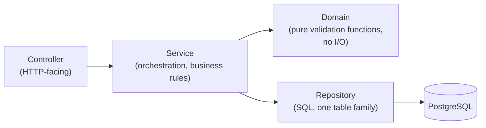

- **Controller** — parses the HTTP request, calls exactly one service method, and translates the result into an HTTP response (status code, JSON body, cookies). It contains no business rules. `AuthController`, `LinksController`, `RedirectController` all follow this shape.
- **Service** — the actual business logic: what has to happen, in what order, and what to do when something goes wrong. `AuthService.signupWithPassword` is a good example: validate → hash password → create user row → catch a unique-violation and translate it into a domain error → create a session → send a welcome email. None of that belongs in a controller, and none of it is raw SQL.
- **Domain** — small, pure, synchronous functions with no I/O: `validateAndNormalizeEmail`, `validatePasswordFormat`. They take a value, return a value or throw a typed error, and are trivially unit-testable without a database or an HTTP server.
- **Repository** — the only layer allowed to write SQL. Each repository owns one table or a small related family of tables (`UserRepository` → `users`, `SessionRepository` → `sessions`). Nothing above this layer knows a column name.

### 5.2 Why this instead of a "fat model" MVC pattern

This question came up directly during the project's development (see the `07-agent-todo-tracker.md` entry for 2026-09-02, "New portfolio-style main README") and is worth restating here because it's central to understanding every file in this codebase.

A classic MVC framework collapses validation, business rules, and persistence into one "Model" object. That works well for CRUD-shaped apps. It works poorly here, for three concrete reasons:

1. **The redirect path and the analytics worker must never be able to call each other's code**, even by accident. If business logic lived on shared model objects, nothing would stop a future contributor from importing worker-side enrichment logic into the redirect handler "just this once" — and the entire performance guarantee in Section 3 depends on that never happening. Splitting into separate services in separate processes with separate `package.json` dependency graphs makes this a structural impossibility, not a code-review convention.
2. **Nearly every test in this codebase injects a fake repository into a real service.** `AuthService`'s password-reset tests (Section 9.6) construct a hand-built object shaped like `EmailService` and pass it straight into the constructor — no mocking framework, no database write, no HTTP server. That is only possible because services take their dependencies as constructor arguments instead of reaching for a global ORM model. A fat-model design would need a real database (or a heavy ORM-mocking library) for the same test.
3. **A classic MVC "View" doesn't map onto this system at all.** The dashboard is a separately deployed React SPA talking to a JSON API — there is no server-rendered view to speak of (with one narrow exception: the public 404/410 error page served directly by the redirect handler, which deliberately stays outside this whole layering because it's static and has no business logic).

The trade-off accepted: this pattern means more files and more explicit wiring (see `app.ts`, which constructs every repository/service/controller by hand) than a framework that does dependency injection automatically. That verbosity is judged worth it because every dependency is visible at the call site — there is no "magic" container to trace through to understand what object a service actually received.

### 5.3 Why plain SQL and no ORM

`node-pg-migrate` for migrations, hand-written parameterized SQL in repositories, no Sequelize/Prisma/TypeORM. Three reasons:

- The click-analytics tables use **PostgreSQL-native partitioning** (`database-schema.md` Section on partitioning) and time-bucket rollup queries with explicit `date_trunc`/`AT TIME ZONE` handling. These are exactly the kind of queries where an ORM's generated SQL becomes a liability, not a convenience — the project already hit one real bug (documented in the rollup work) caused by an implicit type-cast interaction inside a hand-written query; an ORM would have made that class of bug harder to see, not easier.
- The layered architecture (Section 5.1) already gives repositories a place to live. An ORM's main value proposition — generating boilerplate CRUD — is exactly the code repositories already are, and they're a few dozen lines each.
- Explicit SQL means the query that actually runs against production is the query visible in the diff. There's no runtime query-builder behavior to reason about separately from the code review.

## 6. Component breakdown

### 6.1 API service (Express, Node.js, TypeScript strict)

The single process every browser request reaches. It owns three responsibilities that are kept in three different route groups but share one Express app and one middleware pipeline:

1. **The redirect handler** (`GET /:code`) — the highest-traffic, latency-critical path. Cache-first against Redis, PostgreSQL fallback on a miss, and a fire-and-forget enqueue of a click event afterward.
2. **The management API** (`/api/links/*`) — create/list/get/delete links, fetch analytics for a link. This is what the dashboard talks to.
3. **The auth API** (`/api/auth/*`) — signup, login, logout, current-user, Google OAuth start/callback, password reset request/complete.

The middleware pipeline (from `app.ts`) runs, in this exact order, for every request:

```mermaid
flowchart LR
    A["helmet<br/>(security headers)"] --> B["request ID"] --> C["request logging"]
    C --> D["express.json"] --> E["cookie-parser<br/>(signed cookies)"]
    E --> F["health/metrics routes<br/>(bypass everything below)"]
    F --> G["session middleware<br/>(resolves signed-in user, if any)"]
    G --> H["owner-context middleware<br/>(resolves who owns this request)"]
    H --> I["auth routes"] --> J["links routes"] --> K["redirect routes"]
    K --> L["error handler<br/>(maps typed errors to HTTP status)"]
```

**Why session middleware runs before owner-context middleware, and why that order is load-bearing:** owner-context middleware is what every piece of link/analytics code actually depends on — never `request.authenticatedUser` directly. It checks "is there a signed-in user?" first; if yes, ownership is `{ownerType: "authenticated_user", ownerId: user.id}`. If no, it falls through to the pre-existing anonymous-owner-cookie logic, completely unchanged. This ordering, and this single `if` branch, is the entire integration surface between the new account system and the pre-existing link system — see Section 8 for why that was possible with almost no other code changes.

### 6.2 Analytics worker (separate Node.js process)

Consumes click events from a BullMQ queue backed by Redis. For each event: parses the User-Agent string (device/browser), does an offline GeoIP lookup (no external API call, no per-click network round trip), hashes the visitor's IP with HMAC-SHA-256 (the raw IP is never persisted — see Section 10.4), and writes the enriched event to PostgreSQL. It also runs the periodic rollup job that pre-aggregates click events into hourly/daily buckets for faster analytics queries as data grows.

This process shares no code path with the redirect handler beyond the queue message contract itself (a small versioned TypeScript interface both sides import from `packages/shared`). It can be slow, crash, or be entirely offline, and the only consequence is that click analytics arrive late — a redirect never waits on it, because the redirect handler's own code has no function call into this process at all; the only connection is an asynchronous message drop into Redis.

### 6.3 PostgreSQL

The single source of truth for everything durable: links, click events (partitioned by time), analytics rollups, and — as of this phase — users, sessions, and password-reset tokens. Redis holds nothing that isn't reconstructable from PostgreSQL (the redirect cache is a pure cache-aside layer; BullMQ's queue state is transient in-flight work).

### 6.4 Redis

Three unrelated jobs share one Redis instance, each in its own logical keyspace so they can be reasoned about independently:

- **Redirect cache** — `shortCode → longUrl` (and link-state metadata), cache-aside with a TTL, populated on read.
- **Rate limiters** — fixed-window counters (`INCR` + `EXPIRE`), one keyspace for link creation (`rate-limit:create:...`) and a completely separate one for auth endpoints (`rate-limit:auth:...`) — deliberately not shared, explained in Section 9.5.
- **BullMQ queue** — the click-event job queue consumed by the worker.

Every one of these fails open, never closed: if Redis is unreachable, the redirect handler falls back to PostgreSQL for the cache, and both rate limiters let the request through rather than block real users because of an infrastructure outage. Availability of the core product (shortening and following links) is prioritized over the secondary protections (rate limiting, cache speed).

### 6.5 Dashboard (React 19 SPA)

A client-rendered single-page app. It never renders on the server — the only server-rendered HTML in the whole system is the tiny static 404/410 error page the redirect handler serves directly to a visitor whose link doesn't resolve (Section 6.1). The dashboard talks to the API exclusively over same-origin (in production, via the hosting platform's routing — see Section 12) JSON requests with credentials included, so the session cookie travels automatically.

## 7. The ownership model — the single most important abstraction in this codebase

### 7.1 What `OwnerContext` is

```typescript
type OwnerContext =
  | { ownerType: "anonymous_cookie"; ownerId: string }
  | { ownerType: "authenticated_user"; ownerId: string };
```

Every link, and every rate-limit bucket, is tagged with an `OwnerContext`, not directly with a user ID or a cookie value. Link ownership checks, listing "my links," and rate limiting all operate purely in terms of this type — they have never once imported `UserRepository` or known that accounts exist.

### 7.2 Why this made adding accounts a near-zero-risk change

This is worth walking through concretely, because it's the clearest evidence that the design paid for itself.

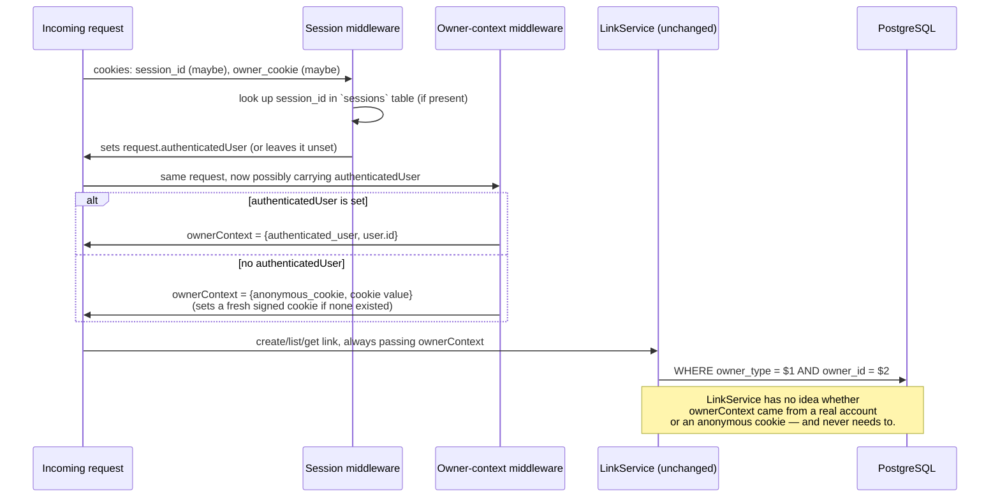

The `owner_type` enum in PostgreSQL already had `'authenticated_user'` as a valid value from the very first schema migration, long before accounts existed as a feature — a deliberate piece of forward-compatible schema design (see `05-database-schema.md`). Because of that, and because `LinkRepository`/`LinkService`/`RedirectService`/`AnalyticsService` all take an opaque `OwnerContext` rather than reaching for a global "current user," implementing accounts required exactly one code change to existing logic: the branch inside `ownerContextMiddleware` shown above. Nothing in the link-management or analytics code was touched, retested for a behavior change, or even read closely — it was already correct for this case by construction.

This was verified, not just argued: `authFlows.test.ts` includes an explicit multi-tenant isolation test that signs up two real users, has each create a link, and confirms each only ever sees their own link through the completely unmodified `LinkRepository`/`LinkService` — proving the isolation holds end-to-end rather than trusting the abstraction on paper.

### 7.3 Why accounts are additive, not required

The product decision (confirmed with the user directly — see Section 2 of the todo tracker entry for this work) was that anonymous link creation must keep working exactly as it does today, with accounts layered on top as an optional upgrade. This shows up as a concrete technical property, not just a policy: `ownerContextMiddleware` always produces *some* valid `OwnerContext`, so no downstream code needs a null-check or a "what if nobody's signed in" branch. A signed-out visitor is a first-class, fully supported state of the system, not a degraded one.

## 8. Authentication and session design

### 8.1 Why database-backed sessions instead of JWTs

A session is a random 32-byte token. The raw token goes into a signed, httpOnly cookie in the visitor's browser. Only a SHA-256 hash of that token is ever persisted, in a `sessions` table row that also carries `user_id` and `expires_at`.

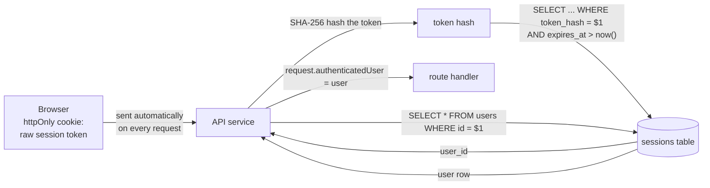

This was chosen over a self-contained JWT for one concrete operational reason: **a session in this design can be revoked instantly by deleting a database row.** Logging out, or a future "sign out of all devices" feature, or an administrator forcibly ending a compromised session, are all a single `DELETE`. A JWT is valid until it expires no matter what the server decides afterward, unless a separate revocation-list mechanism is bolted on — which is itself just a database-backed session system with extra steps. Given this system already has PostgreSQL as its source of truth and the extra lookup is a single indexed query, there was no real efficiency argument for JWTs that outweighed giving up instant revocation.

Only the hash is ever stored, mirroring a pattern this codebase already used before accounts existed at all: visitor IP addresses are HMAC-hashed before being persisted for analytics (Section 10.4), for the same underlying reason — a value that would be sensitive or exploitable if leaked from a database dump should never be recoverable from that dump in the first place. A leaked `sessions` table row cannot be turned back into a usable cookie value.

### 8.2 Why passwords use bcrypt via `bcryptjs`, not native `bcrypt`

12 salt rounds, computed with the pure-JavaScript `bcryptjs` package rather than the native-binding `bcrypt` package. The native package needs a working C++ build toolchain at `npm install` time, which is a real source of friction on Windows development machines (this project's actual development environment) and in some minimal container images. `bcryptjs` trades a small amount of raw hashing speed for zero native compilation requirements, which was judged the right trade for a project-scale application where password hashing is not a throughput bottleneck.

### 8.3 Why login failures are indistinguishable regardless of the reason

```typescript
if (user === null || user.passwordHash === null) {
  // still run a bcrypt compare against a dummy hash, so a missing
  // account takes roughly the same time as a wrong password
  await bcrypt.compare(rawPassword, DUMMY_HASH);
  throw new InvalidCredentialsError();
}
```

Whether the email address doesn't exist, or it exists but the password is wrong, the caller sees the exact same error message and the server does roughly the same amount of work either way (a real bcrypt comparison happens in both branches). Without the dummy comparison, "account doesn't exist" would return noticeably faster than "wrong password" (no bcrypt call at all), which is a timing side-channel an attacker could use to enumerate which email addresses have accounts. This is the same reasoning applied a second time, independently, in the password-reset flow (Section 8.5).

### 8.4 Google OAuth — why hand-rolled instead of a full auth framework

`GoogleOAuthService` uses `google-auth-library`'s `OAuth2Client` for exactly two things: building the authorization URL and verifying the ID token Google returns. Everything else — the CSRF `state` cookie, the redirect orchestration, deciding whether a Google sign-in creates a new account, links to an existing password account, or signs into an existing Google account — is plain application code in `AuthService`, not a framework's opinion.

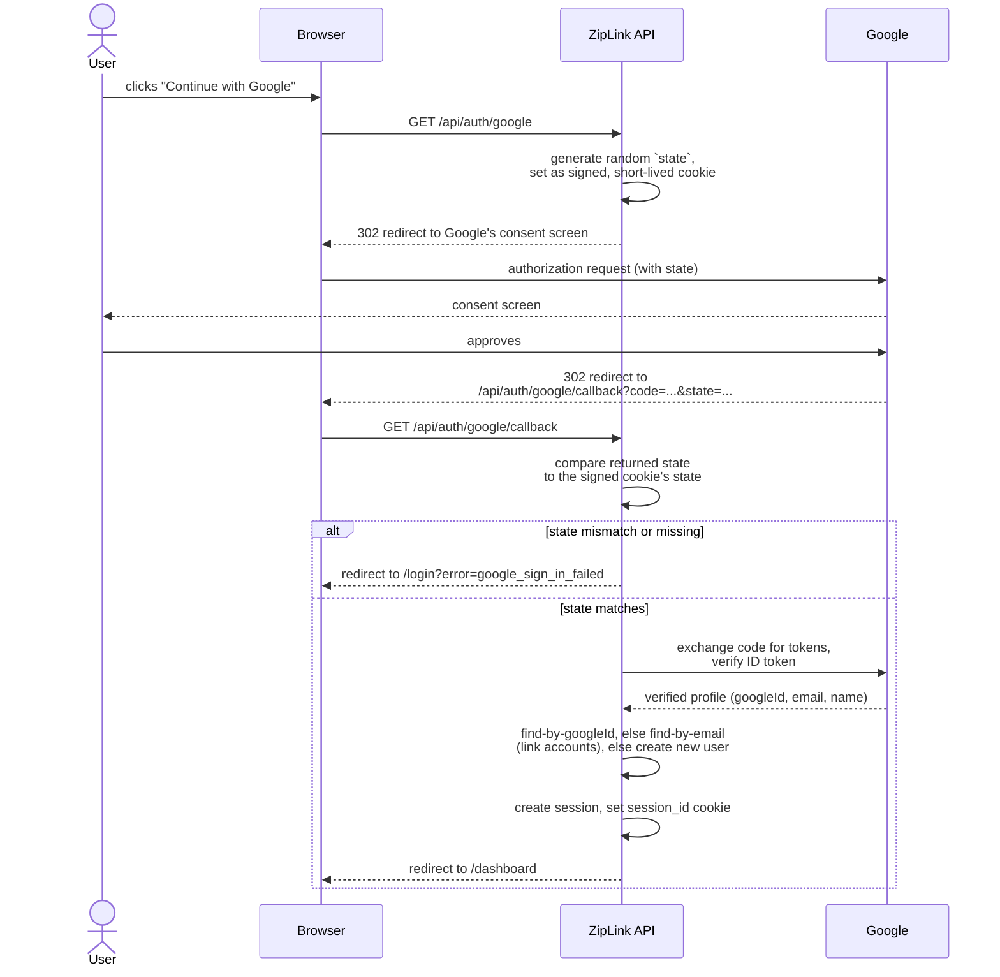

**Why the `state` cookie matters:** without it, an attacker could initiate an OAuth flow themselves, capture Google's redirect, and trick a victim's browser into completing it — a form of session-fixation/CSRF against the login flow. The `state` value is generated server-side, stored in a cookie the attacker cannot read or forge (it's signed with the same secret as every other cookie in this app), and must match what Google echoes back before the callback does anything.

**Why account linking by email, not just by Google ID:** if someone signed up with a password first and later clicks "Continue with Google" using the same address, the flow attaches the Google identity to their *existing* account (`attachGoogleIdToUser`) instead of silently creating a second, disconnected account with the same email — which would otherwise split one person's links across two accounts with no way to reunite them. This is safe specifically because Google has already verified the email address as part of its own OAuth flow — the account is being linked on the strength of Google's verification, not on a bare unverified claim.

**Why both credentials are optional at the config level:** `googleOAuthClientId`/`googleOAuthClientSecret` are nullable, and `GoogleOAuthService` is only constructed when both are present. Local development never requires a real Google Cloud project. The frontend learns whether to even show the button from `googleSignInEnabled` in `GET /api/auth/me`'s response (Section 8.7) rather than guessing.

### 8.5 Password reset — why it never reveals whether an email has an account

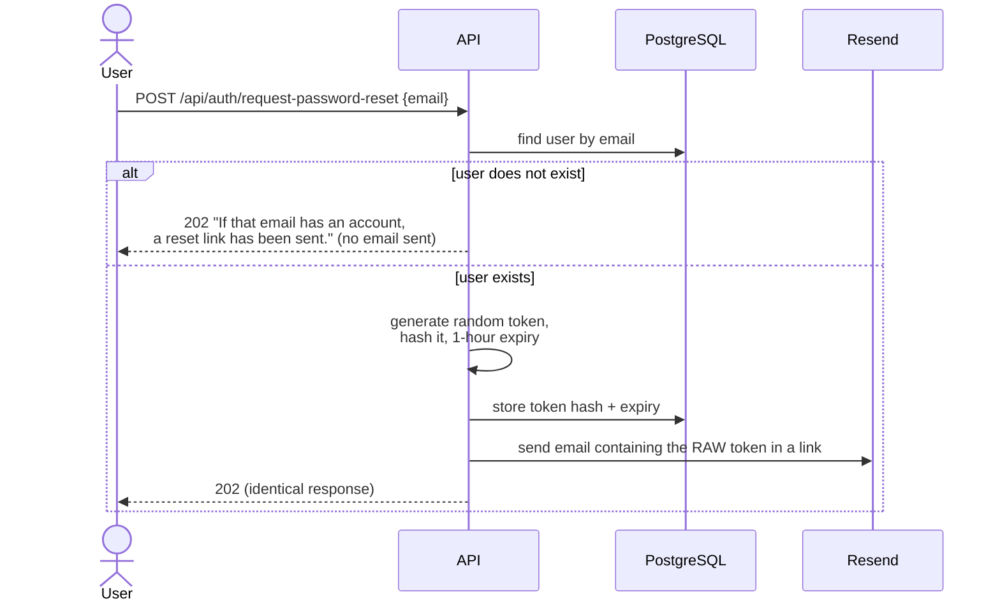

The HTTP response is identical either way — 202, same message, same timing characteristics as closely as practical — specifically so this endpoint cannot be used to check which email addresses are registered. This is the third independent application of the same principle in this subsystem (alongside login timing in Section 8.3 and hashed-token storage in Section 8.1): **the system should never leak more information than the specific operation requires**, even when the leak seems minor in isolation.

### 8.6 Why email delivery is a fail-open, swappable adapter

`EmailService.send()` never throws. If no Resend API key is configured, it logs what would have been sent instead of sending it; if the Resend HTTP call itself fails, that's caught and logged too. A welcome email failing to send must never fail the signup that triggered it — the account is the product; the email is a courtesy. Using Resend's plain HTTP API via `fetch` rather than an SDK keeps this a small, inspectable adapter with no extra dependency surface; swapping providers later means rewriting one file, not unwinding an SDK integration threaded through the codebase.

### 8.7 Why the auth rate limiter is a deliberate duplicate, not a shared abstraction

`AuthRateLimiter` is structurally almost identical to the pre-existing `CreationRateLimiter` (same fixed-window `INCR`/`EXPIRE` pattern, same fail-open behavior) but is its own class with its own Redis keyspace (`rate-limit:auth:...` vs `rate-limit:create:...`). Generalizing them into one shared, parameterized limiter was considered and rejected for this change specifically: the explicit constraint on this work was "make sure implementing these doesn't break anything," and `CreationRateLimiter` already had passing tests protecting real production behavior. Refactoring it to serve a second caller — even carefully — is a strictly higher-risk change than writing forty duplicate lines, for a project at this size. This is a conscious short-term trade of a small amount of duplication for a large reduction in blast radius; revisiting it once there's a third rate-limited surface (at which point a shared abstraction earns its complexity) is a reasonable future refactor, not a design flaw to fix today.

## 9. Request-path deep dives

### 9.1 Redirect (the latency-critical path)

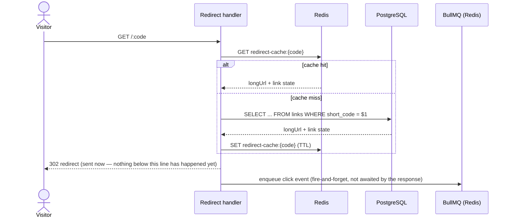

The 302 response line in this diagram is drawn deliberately above the enqueue call: the HTTP response is written and sent before the queue publish is even attempted, and the publish's own success or failure has zero effect on what the visitor already received. A `ClickEventPublisher` failure is caught, logged, and silently dropped — the click just doesn't appear in analytics, which is judged the correct trade-off (a slightly incomplete analytics history) against the alternative (ever delaying or failing a redirect because of an analytics-side problem).

### 9.2 Authenticated link creation (showing the ownership branch in practice)

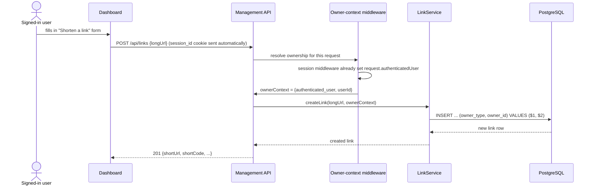

### 9.3 Signup

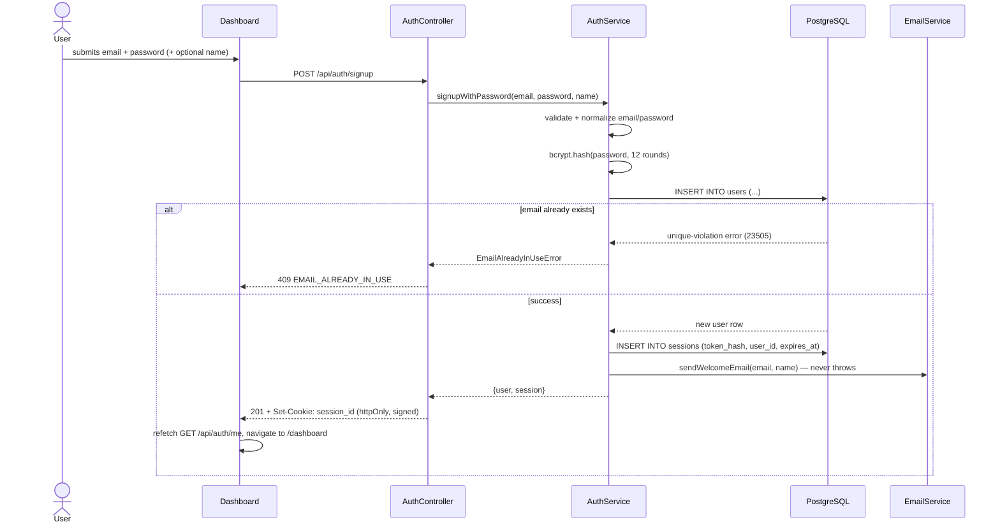

### 9.4 Click-analytics pipeline (fully decoupled from the redirect above)

```mermaid
sequenceDiagram
    participant Queue as BullMQ (Redis)
    participant Worker as Analytics worker
    participant UA as UA parser
    participant Geo as GeoIP lookup (offline)
    participant DB as PostgreSQL

    Queue->>Worker: deliver click event job
    Worker->>Worker: HMAC-SHA-256 hash the visitor IP<br/>(raw IP discarded immediately)
    Worker->>UA: parse User-Agent string
    UA-->>Worker: device + browser
    Worker->>Geo: look up hashed-adjacent IP bucket (offline DB, no network call)
    Geo-->>Worker: approximate country/city
    Worker->>DB: INSERT INTO click_events (enriched row)
    Worker->>Worker: on failure: retry with backoff (BullMQ);<br/>on repeated failure: dead-letter, logged
```

This entire diagram can fail, stall, or run minutes behind in a traffic spike, and Section 9.1's redirect path is completely unaffected — there is no code path connecting them except the one-way queue message.

## 10. Security posture

### 10.1 Transport and headers

`helmet` sets standard security headers (CSP-adjacent headers, `X-Content-Type-Options`, etc.) on every response. Session and OAuth-state cookies are `httpOnly` (invisible to JavaScript, defeating XSS-based cookie theft), `sameSite: "lax"` (sent on top-level navigations like the OAuth redirect, but not on cross-site subresource requests — the right middle ground for a flow that legitimately needs a cross-site redirect to carry a cookie back), `secure` in production (HTTPS-only), and `signed` (tamper-evident, using the same server-side secret as the existing anonymous-owner cookie).

### 10.2 Defense against timing and enumeration attacks

Covered in depth in Sections 8.3 and 8.5: login and password-reset-request both give the same response regardless of whether an account exists, and login performs the same cryptographic work in both branches so response time doesn't leak the answer either.

### 10.3 CSRF

The OAuth `state` cookie (Section 8.4) is the one flow in this system with a real cross-site redirect step, and it gets an explicit CSRF token for that reason. The rest of the API relies on `sameSite: "lax"` cookies plus the fact that it's a JSON API expecting `Content-Type: application/json` — a classic form-based CSRF attack (an auto-submitting HTML form on an attacker's site) cannot set that header, so it cannot successfully forge a state-changing request here even without a separate CSRF token.

### 10.4 What is never persisted, and why

Two independent examples of the same principle, applied at different points in the system's history:

- **Raw visitor IP addresses** (pre-existing, before accounts) — only an HMAC-SHA-256 hash is stored, keyed by a server-side secret with an explicit key-version field for future rotation. A database dump can never be turned back into "this specific IP address visited this link."
- **Raw session and password-reset tokens** (this phase) — only a SHA-256 hash is stored. A database dump can never be turned back into a usable session cookie or a usable reset link.

Both decisions follow the same test: *if this table leaked today, could the leaked data be replayed as a working credential or reversed into a real-world identifier?* If the honest answer is yes, the value doesn't get stored in recoverable form.

### 10.5 Rate limiting

Two independent fixed-window limiters (Section 6.4), one for link creation, one for auth endpoints, both fail-open on a Redis outage (an infrastructure failure degrades protection, not availability — Section 6.4 explains the reasoning). The auth limiter exists specifically to slow down credential-stuffing and account-enumeration attempts against `/api/auth/login` and `/api/auth/signup`, which is a different threat model from the creation limiter's job of preventing link-spam abuse — the reason they're separate limiters with separate keyspaces rather than one shared "requests per owner" counter (Section 8.7).

## 11. Data model (accounts-related tables)

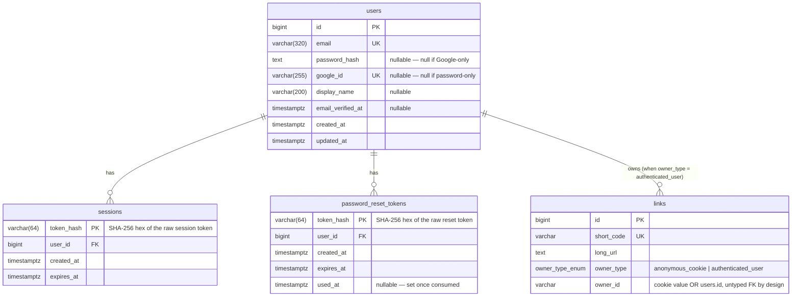

**Why `users.owner_id` on `links` is not a typed foreign key:** it has to hold either an opaque anonymous-cookie value or a real `users.id`, and those are different kinds of values from different tables. A typed FK would only work for one of the two owner types, defeating the entire point of `OwnerContext` being able to represent both uniformly (Section 7.1). This is an intentional, documented relaxation of referential integrity at exactly one column, in exchange for the abstraction that made accounts an additive feature instead of a rewrite.

**Why `users` allows either `password_hash` or `google_id` to be null, but not both:** a database-level `CHECK` constraint (`users_has_login_method`) enforces that every user row has at least one way to sign in. A Google-only user has no password to leak if the `users` table is ever dumped; a password-only user has no Google dependency. Both are first-class, not one being a degraded version of the other.

## 12. Deployment architecture

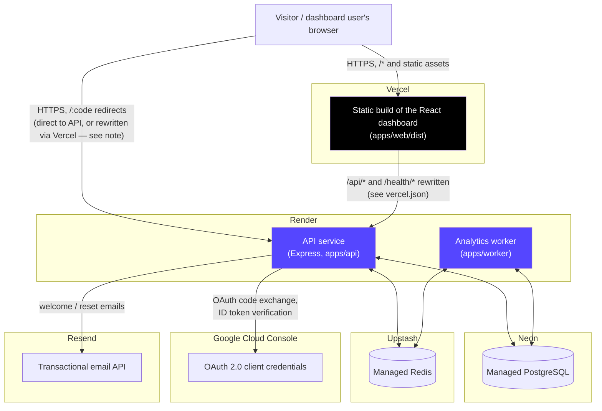

### 12.1 Why this specific platform combination

- **Vercel for the dashboard** — a static Vite build with no server-side rendering requirement (Section 6.5), which is exactly Vercel's strongest and cheapest use case. `vercel.json` rewrites `/api/*` and `/health/*` to the Render-hosted API, so from the browser's point of view the dashboard and the API appear same-origin — this matters specifically because the session cookie (Section 8.1) is easiest to reason about and secure as a same-site cookie rather than configuring cross-site cookie exceptions.
- **Render for the API and worker** — both are long-running Node.js processes (the API listens on a port continuously; the worker holds an open BullMQ connection), which fits a persistent-process host rather than a serverless-function host. Render's free tier supports exactly this shape for a portfolio-scale deployment.
- **Neon for PostgreSQL** — a managed, serverless-friendly Postgres with a generous free tier and a plain connection string, requiring no code changes from the `DATABASE_URL`-based configuration this project already uses for local development.
- **Upstash for Redis** — the same reasoning as Neon: a managed Redis reachable by a connection string, needing no code change, with a free tier sized appropriately for this project's traffic.
- **Resend for email** — chosen specifically for having a plain HTTP API with a generous free tier, avoiding an SMTP client dependency and its associated connection-pooling concerns for a low-volume transactional email use case (welcome + password-reset mail only, not bulk sending).

### 12.2 What had to change in the code to make this split-host deployment work, and why

- **`TRUST_PROXY_HOPS`** (added in an earlier phase, Section 9 of `07-agent-todo-tracker.md`'s 2026-09-02 entry) — Render sits its own reverse proxy in front of the API, so `X-Forwarded-For` is only trustworthy once that's accounted for. This defaults to `0` (untrusted) everywhere except a real deployment, because trusting a forwarded-IP header with nothing legitimate in front of it lets any caller spoof their own IP.
- **`DASHBOARD_BASE_URL`** (this phase) — the API needs to know the dashboard's real public URL to build absolute links that leave the API process entirely: the password-reset email link and the post-OAuth redirect destinations. Defaults to `http://localhost:5173` for local development.
- **Same-origin cookies via the Vercel rewrite**, not a cross-site cookie configuration — chosen over the alternative (setting `sameSite: "none"` and configuring CORS credentials) because same-site cookies are simpler to secure correctly and match this project's existing `sameSite: "lax"` cookie posture (Section 10.1) without weakening it for the sake of the split-host deployment.
- **A catch-all SPA rewrite** (`{ "source": "/(.*)", "destination": "/index.html" }`, placed last in `vercel.json`'s `rewrites` array so it never shadows the `/api/*`/`/health/*` rules Vercel evaluates first-match-wins) — without it, refreshing or directly navigating to any client-side route (e.g. `/dashboard/links/:code`) had no matching static file on Vercel and returned a real `404`, since only the dashboard's own client-side router, not the static host, knows that path is valid.
- **Two independent deploy pipelines create a real consistency window.** Vercel (a static build) typically finishes redeploying well before Render (a from-scratch Docker build) does, and neither waits on the other. A frontend deploy can briefly be talking to an API still running the previous version — this is a genuine, observed failure mode (a live incident during this project's own development: a new frontend field with no defensive fallback and no error boundary anywhere in the app crashed an entire page to blank). The fix applied is defense in depth, not a single guard: optional-chaining fallbacks on fields a newer frontend might expect from an older API response, `BreakdownCard` treating a missing rows array as empty rather than throwing, and a proper React error boundary (`ErrorBoundary.tsx`) around each page's content so any future rendering error — from this cause or another — degrades to a small recovery card instead of unmounting the whole app. The underlying window itself is accepted, not eliminated: it is a short-lived, self-resolving property of having two independent deploy pipelines, and closing it completely would mean coordinating deploys across two different platforms, which is a much larger and less valuable change than making the frontend tolerate it gracefully.

## 13. Design principles applied consistently across this codebase

These recur throughout the sections above; naming them once, together, makes the pattern visible:

1. **Fail open on infrastructure, fail closed on identity.** Redis being down degrades caching and rate limiting, never blocks a redirect or a login. A session token that doesn't match anything is always treated as signed-out, never as an error to work around.
2. **Never store what you don't have to.** Raw IPs, raw session tokens, raw reset tokens — all hashed or discarded, never persisted in a form that's useful if leaked (Section 10.4).
3. **Never let a response reveal more than the specific operation needs to.** Login and password-reset-request give identical responses regardless of what's true internally (Sections 8.3, 8.5).
4. **A slow or broken secondary system must never block the primary one.** Redirects don't wait on analytics (Section 9.1/9.4); signups don't fail because a welcome email couldn't send (Section 8.6).
5. **Prefer an abstraction that already generalizes over a special case bolted on later.** `OwnerContext` existed before accounts did, specifically so accounts wouldn't require rewriting the systems built around it (Section 7).
6. **When a shared abstraction would increase risk to already-tested code, duplicate instead — and say so.** The auth rate limiter (Section 8.7) is the clearest example, chosen explicitly because the constraint on that work was "don't break what's already working."

## 14. Analytics feature extensions

A second phase of work added five analytics-facing features on top of the system described above: unique visitors, UTM/campaign tracking, operating-system breakdown, period-over-period comparison, and CSV export. None of them required a new subsystem — each one reuses data or infrastructure that already existed for a different reason, which is worth making explicit since it's a direct continuation of the "prefer an abstraction that already generalizes" principle (Section 13.5).

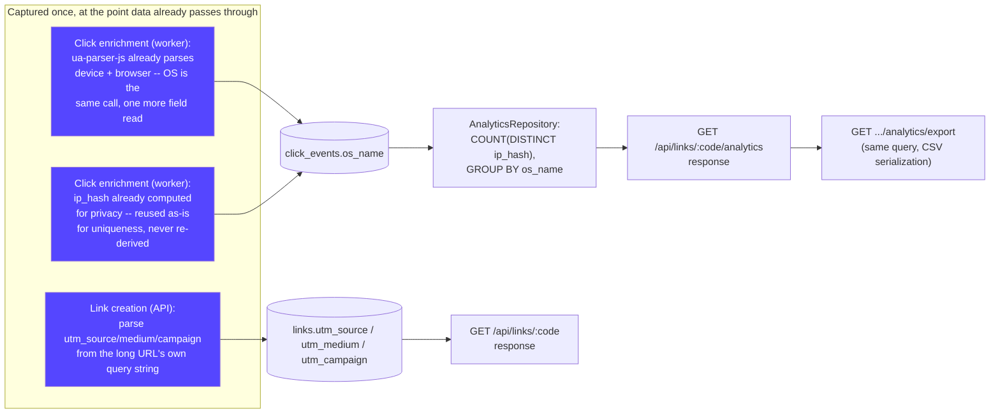

### 14.1 Unique visitors — approximated by reusing the existing IP hash, not a new visitor-tracking mechanism

`AnalyticsRepository.getUniqueVisitorCount` is `COUNT(DISTINCT ip_hash) WHERE ip_hash IS NOT NULL` over the same `click_events.ip_hash` column that has existed since before accounts, worker OS parsing, or any of this phase's work — originally written purely for the HMAC-hashed-IP privacy guarantee (Section 10.4), now doing double duty as a uniqueness key. No new column, no new cookie, no new hashing logic.

This was a deliberate accuracy trade-off, made explicitly rather than by default: an IP-hash-based count **undercounts** uniqueness behind shared or carrier-grade NAT (many real visitors sharing one public IP look like one visitor) and **overcounts** if one visitor's IP changes between visits (mobile networks reassign IPs often). The alternative — a dedicated first-party visitor cookie, set on first click and hashed the same way before storage — would be more accurate per person, at the cost of a new piece of client-side state and a new privacy surface to reason about and document. For a portfolio-scale product where "approximately how many distinct people" is more useful than "exactly how many," reusing existing infrastructure was judged the better trade; the response field name (`uniqueVisitors`) and its accompanying UI copy ("Approximated by distinct hashed IP addresses") both say so honestly rather than implying more precision than the number actually has.

### 14.2 UTM/campaign tracking — captured once, scoped to one link, not a cross-campaign feature (yet)

`utm_source`/`utm_medium`/`utm_campaign` are parsed from the destination URL's own query string at creation time (`apps/api/src/domain/utmParsing.ts`, a pure function following the same shape as every other domain validator in this codebase) and stored directly on the `links` row. They are never re-parsed, re-derived, or allowed to change after creation — the destination URL itself doesn't change after a link is created, so there's nothing for them to track "over time."

This is deliberately scoped narrower than a full campaign-analytics feature: it captures and displays UTM parameters on that one link's own detail page, but does not add a cross-link view that aggregates every link sharing the same `utm_campaign` value. That cross-link aggregation is really the same underlying need as a not-yet-built cross-link dashboard (README's "Future improvements" list) — building it now would mean either duplicating that future work or building it prematurely, scoped only to campaigns, before the more general owner-scoped aggregate view exists. Capturing the data now and deferring its cross-link aggregation is the smaller, correctly-scoped increment; the data being stored from day one means that future feature is additive, not a backfill migration.

One correctness detail worth stating plainly: UTM parameters are part of the URL's query string, and duplicate-link detection (`findActiveDuplicateByOwnerAndNormalizedUrl`) normalizes on the **full** URL including its query string (`buildNormalizedUrl` in `urlValidation.ts`). Two otherwise-identical URLs differing only in `utm_campaign` therefore normalize to two different values and are correctly treated as two separate links, each with its own captured UTM data — they never collide into a false "duplicate."

### 14.3 Operating-system breakdown — one more field from a call the worker already makes

The worker's `parseUserAgent` (in `userAgentParser.ts`) has always run `ua-parser-js` against the User-Agent header to classify device type and browser; the same parse result also carries the OS name, previously read and discarded. This phase reads that field too and stores it alongside `device_type`/`browser_name` on `click_events` (`os_name`, following the same `COALESCE(..., 'Unknown')` pattern the browser breakdown query already used). Nothing new is parsed, hashed, looked up, or called — this is the cheapest of the five features by a wide margin, and its low cost was the reason it was in scope alongside genuinely new work like unique visitors and UTM capture.

### 14.4 Period-over-period comparison — a frontend-only feature, deliberately with no new backend endpoint

`GET /api/links/:code/analytics` already accepted an arbitrary `from`/`to` range before this phase. Comparing "this period" to "the period immediately before it" therefore needed no new backend capability at all: the dashboard's `usePeriodComparison` hook computes the immediately-preceding, equal-length range client-side and calls the exact same endpoint a second time. The percentage delta itself (`computePercentChange`, a small pure function, unit-tested in isolation) is computed in the browser, not the API.

The one deliberate constraint: this second fetch only happens while the "Compare to previous period" toggle is on — not automatically on every page load — so opting out costs nothing. Adding a dedicated `/analytics/compare` endpoint that computed both ranges and the delta server-side was considered and rejected: it would only save one network round trip, at the cost of a new endpoint, a new response shape, and a second place the same query logic has to be kept correct — not a good trade for a feature whose backend half already existed.

### 14.5 CSV export — the same authorization and the same query, a different serialization

`AnalyticsController.exportLinkAnalyticsCsv` calls `AnalyticsService.getLinkAnalytics` — the exact same method, with the exact same ownership check and range/timezone/bucket validation, that backs the JSON endpoint — and passes the result through `buildAnalyticsCsv`, a pure domain function that renders it as a multi-section CSV (`Summary`, `Timeline`, `Referrers`, `Devices`, `Operating Systems`, `Browsers`, `Geography`). There is no separate authorization path to get wrong, no separate query to keep in sync, and no risk of the export ever showing different (or differently-authorized) data than the dashboard itself shows for the same range.

The export deliberately contains only the same aggregate breakdowns the dashboard already displays — never a per-click row. This was a direct decision, not an oversight: this codebase has held a consistent line since before accounts existed that click-level and IP-level data is never exposed, even to a link's own owner (Section 10.4's "what is never persisted, and why," and the geography city-suppression threshold in Section 9's analytics notes). A per-click CSV export — timestamp, referrer, device, browser, OS, country/city per row — would be a new category of data exposure this project has specifically avoided elsewhere, for the same underlying reason a handful of clicks from one named city are folded into their country rather than shown individually: aggregate counts don't identify a specific visitor's behavior; a timestamped per-click log starts to.

## 15. Trade-offs and honest limitations

- **No refresh-token rotation or short-lived access tokens** — sessions are long-lived (30 days) and revocation is all-or-nothing per session. Acceptable for this product's risk profile; a system handling more sensitive data would want shorter-lived tokens with rotation.
- **Email verification is not enforced at login** — a welcome email is sent, but an unverified email can still sign in. This was a deliberate scope decision (not required by the product ask) to avoid adding a verification-gate flow; `email_verified_at` already exists on the schema so enforcing it later is additive, not a migration.
- **The auth rate limiter's duplication (Section 8.7) is deliberate debt**, expected to be revisited once a third rate-limited surface exists.
- **No CAPTCHA or bot-detection on signup** — rate limiting is the only defense against automated account creation today.
- **Single-region deployment** — Neon/Upstash/Render are each provisioned in one region; there's no multi-region failover story yet, consistent with this being a portfolio-scale deployment rather than a system designed for geographic redundancy.
- **`uniqueVisitors` is an approximation, not an exact count** (Section 14.1) — accepted deliberately, but worth restating here alongside the system's other honest imprecisions.
- **The worker's optional HTTP health server is gated on its own `ENABLE_WORKER_HTTP_HEALTH_SERVER` flag, not on `PORT` being present** — a real bug surfaced during deployment: local development and docker-compose share one root `.env` file across every process, and that file's `PORT` is meant only for the API. Reacting to `PORT` alone made the worker try to bind the API's own port and crash locally. The fix follows this project's existing pattern for deployment-only behavior (Google OAuth, Resend, `TRUST_PROXY_HOPS`): off by default, explicit opt-in only where actually needed — set only on the deployed Render worker service, never locally.
- **A hosting platform's own health-check polling can itself become a real, metered cost.** Render's `healthCheckPath` is polled continuously (every few seconds) for as long as a service is deployed, and `HealthController.handleReadiness` originally pinged real Redis and Postgres on every call — a genuine, observed incident: this alone drove an Upstash free-tier Redis instance to 450k/500k monthly commands used, entirely independent of real application traffic. Fixed two ways at once: `render.yaml` now points Render's health check at `/health/live` (which never touches a dependency, and is all Render's restart decision actually needs — it only reads the HTTP status code, which Redis failure never changes anyway), and `HealthController` now caches each dependency check result for 10 seconds regardless, as defense in depth against any other frequent poller hitting `/health/ready` directly. The broader lesson generalizes: on a metered-quota free tier, *any* code path a platform calls automatically and repeatedly deserves the same scrutiny as a hot path in the request-handling code itself — it was reviewed for correctness when written, but not for being called far more often, by infrastructure rather than users, than anyone had accounted for.

## 16. Where to look next

- `01-prd.md` / `02-technical-specification.md` — the original product and technical requirements this system was built against.
- `05-database-schema.md` — full column-by-column schema reference, including the click-event partitioning strategy only summarized here.
- `09-technical-reference.md` — operational detail: benchmarks, the full deployment walkthrough, environment variable reference, and the complete test-suite breakdown.
- `07-agent-todo-tracker.md` — the chronological, evidence-based build log this document draws its "why" explanations from; useful when a decision here needs even more context than fits in this document.
